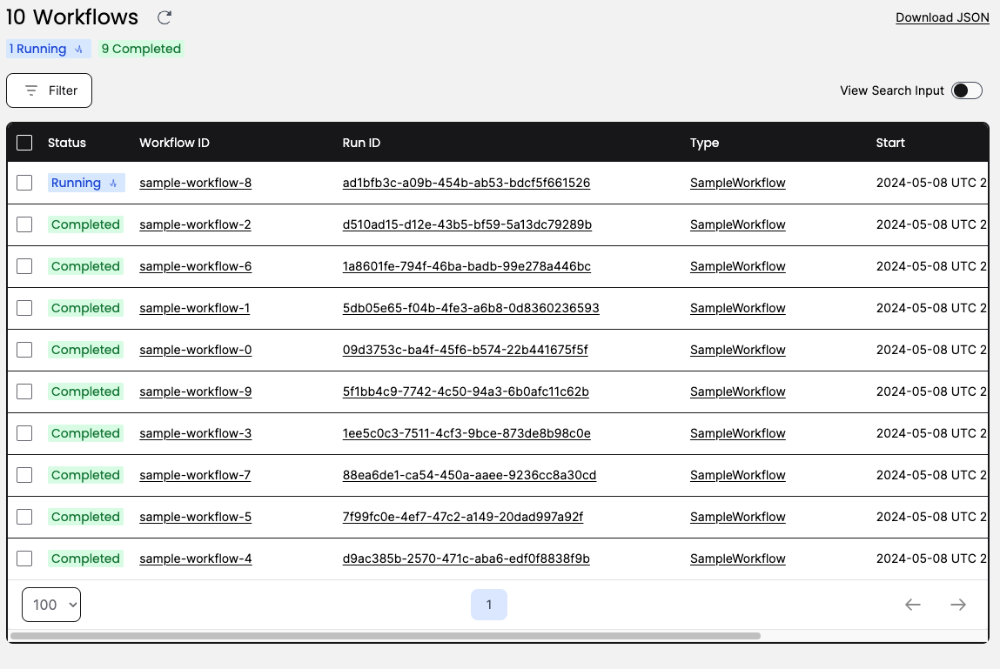
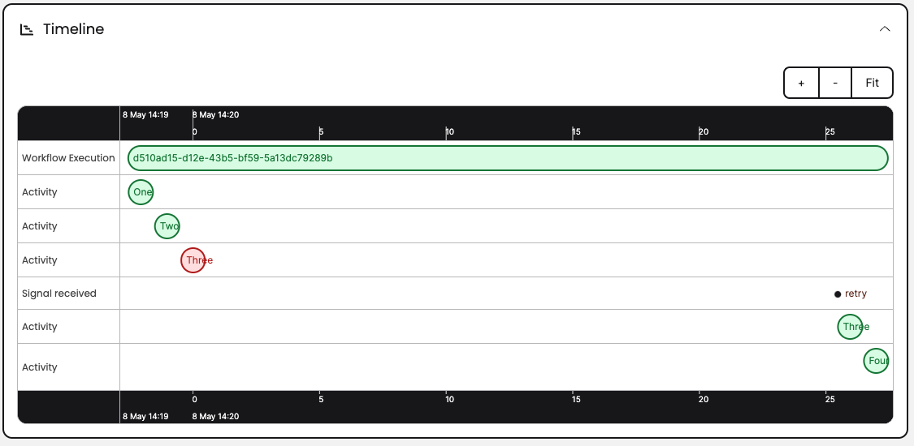

## Sample Int
Demos various aspects of [Temporal](https://temporal.io) using the [Java SDK](https://github.com/temporalio/sdk-java). The sample is a SpringBoot application.

The app will start 10 workflows. Each workflow has four activities and each activity has a chance to fail. Once an activity fails the workflow is paused. 
A signal is used to resume (retry) or fail workflow. Failing workflow triggers compensation and our SAGA. 
Compensation is done through async via a child workflow. 
Signals are sent to multiple workflows using a batch operation. 
The workflow definition is provided as DSL (json) showing how to create a simple abstraction of steps to execution but still have the full powere of Temporal.
We of course always recommend to write your business logic fully via code which is much more powerful.


| Prerequisites |   | __ | Features       |  | __ | Patterns            | |
|:--------------|---|----|----------------|--|----|---------------------|-|
| Java 17+      | ✅ | __  | Schedule       |  | __ | Entity              | |
| Temporal CLI  | ✅   | __ | Local Activity |  ✅ | __ | Long-Running        | |
|               |   | __ | Timer          | ✅ | __ | Fanout              | |
|               |   | __ | Signal         | ✅ | __ | Continue As New     | |
|               |   | __ | Query          |  | __ | Manual Intervention | ✅ |
|               |   | __ | Update         |  | __ | Saga                | ✅ |
|               |   | __ | Heartbeat      |  | __ | Long-polling        | |
|               |   | __ | Retry          | ✅ | __ | Batch Operations    | ✅ |
|               |   | __ | Data Converter |  | __ | DSL                 |  ✅ |
|               |   | __ | Child Workflow | ✅ | __ |                  | |

### Install Temporal CLI

Detailed instructions are in docs https://docs.temporal.io/cli#install

### Start Local Temporal Server
```bash
$ temporal server start-dev
```

### Create Search Attribute
```bash
$ temporal operator search-attribute create --name pause --type Bool --namespace default --address 127.0.0.1:7233
```

### Start app
```bash
$ mvn clean install spring-boot:run
```

### Access app
     localhost:3003

### Access Temporal UI
    http://localhost:8233

### How to use


#### Start workflows
As mentioned, some amount of workflows should complete and others which encounter a simulated activity failure will be paused (running). You can either retry or fail all paused workflows.

The UI workflow view shows we have completed most workflows but one is paused as they encountered simulated activity failure.



#### Retry workflows
In this case we send a retry signal and the workflows are resumed at the activity they left off with. This can be useful if for example, a downstream is unavailable and retrying makes no sense until the issue is resolved.

The UI timeline view of the workflows shows we have resumed workflow after initial failure.



#### Fail workflows
In this case we send a fail signal and the workflows are failed. We run compensation in a child workflow using a SAGA which will rollback any changes that may have occurred. By doing the compensation in a child workflow, we have decoupled it and gained lots of visibility as well as flexibility. In case compensation workflow fails we can also for example, retry it.

The UI workflow view shows we have failed workflows.


#### Retry compensation workflows
In case we failed paused workflows and the compensation workflow fails, we will have a paused running compensation workflow which we can now retry.

The UI timeline view of the workflows shows we have resumed compensation after initial failure.


#### Fail compensation workflows
In case we failed paused workflows and the compensation failed, we will have a paused running compensation workflow which we can now fail.

The UI workflow view shows we have failed compensation workflows.


#### List Batch Operations
We are performing signals (retry or fail) on multiple workflows using batch operation. We can list all batch operations.


#### Stop Batch Operations
We are performing signals (retry or fail) on multiple workflows using batch operation. We can stop all batch operations.

